+++
title = "Build a very cheap quadcopter"
description = "the goal was to buy as few as possible parts and keep it cheap."
tags = [
  "diy",
  "quadcopter",
]
date = 2015-07-19T19:16:50Z
author = "Felix Bühler"
+++

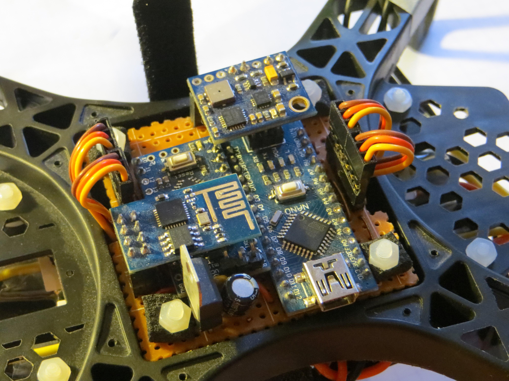

This project was done together with [Friedrich Weise](https://weise.io).
The goal was to have a quadcopter and design the data transmission ourselves. We decided to build everything in 7 days (which was a very tight schedule).

We were both not experienced in coding. So the scripts should never be made public because we both think they would cause more harm than good.

# Day 1

The first day was a lot of testing of every peripheral.

First, the ESP was flashed with NodeMCU. Then we continued writing some basic Lua-Scripts to have a Wifi-Hotspot on the ESP8266.

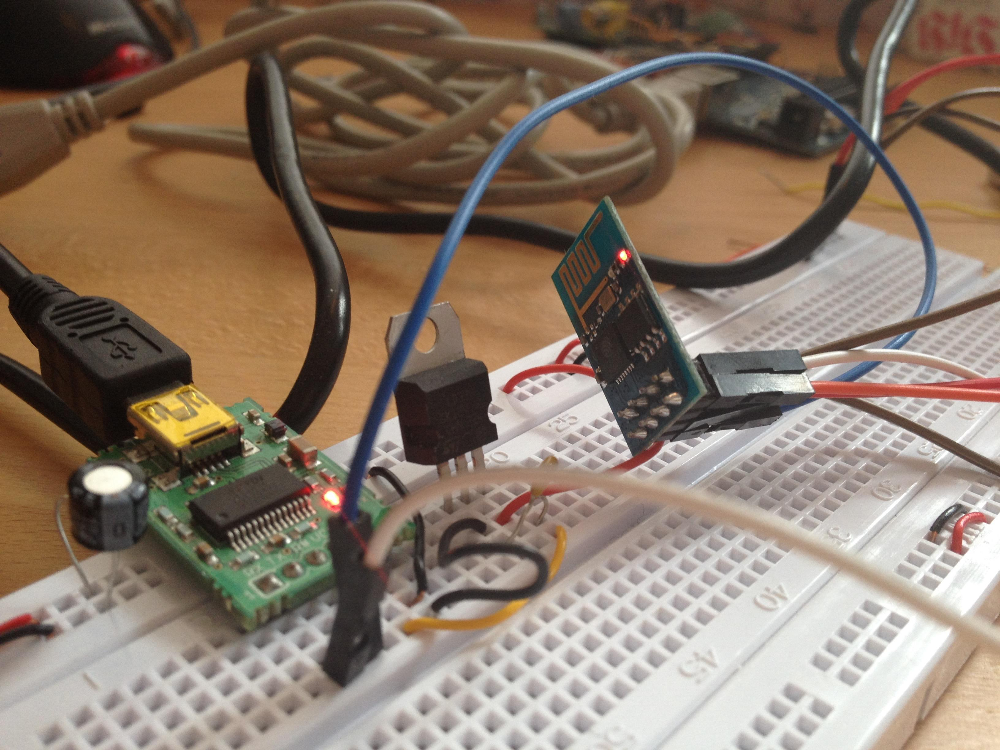

We implemented our first python-script to send data via UDP to the ESP8266. The script was very basic at the time, but it was enough to verify the receiving ESP8266 was OK.

The IMU got some feets soldered and was tested. Testing the movement was pretty impressive, how precise and fast it can track everything.
During the day we spend some thought on how to damp the vibrations because this could influence the measurements of our IMU greatly.

Another important test was the connection between two Microcontrollers: We decided to have one Microcontroller with MultiWii as our flight controller. The other one will talk with the flight controller and the ESP8266. Flight controllers usually expect a PPM(pulse-position modulation) signal. To make sure the flight controller can work without decoding information from the ESP8266 directly we decided to have another microcontroller, which talks Serial-protocol with the ESP8266 and send the information to the flight controller via PPM.
The ESP8266 received our data successfully, but the microcontroller did not receive any. So this task was for the next day.

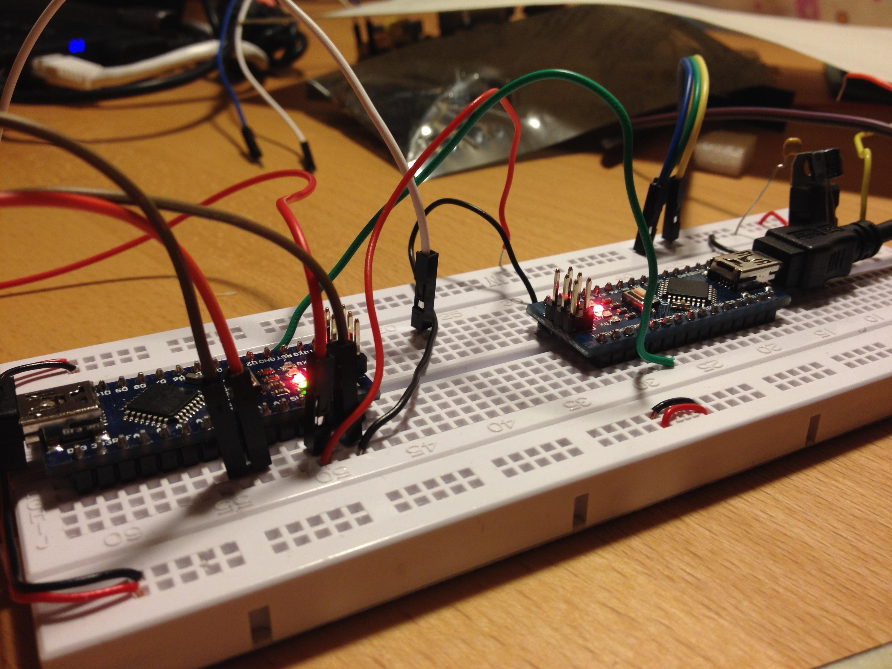

# Day 2

Because we already planned ahead a lot we knew what has to be placed on the board. Therefore we noticed, that the space was limited. So we explored how to use the space as good as possible while keeping in mind to solder everything in place. This was well ahead of our timeline, but noticing the tight space was an important reminder.

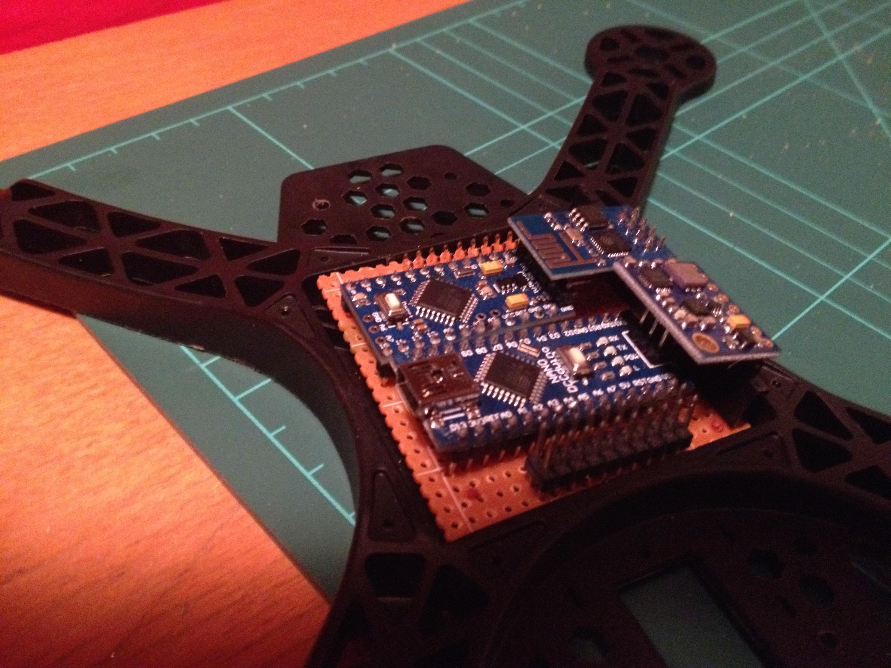

Next up we continued connecting everything together with our flight controller to test if our initial plan was feasible. We did this quite dirty, but for testing this was fine. We still got a problem with the connection between the ESP8266 and the microcontroller. But we will fix this the next day.

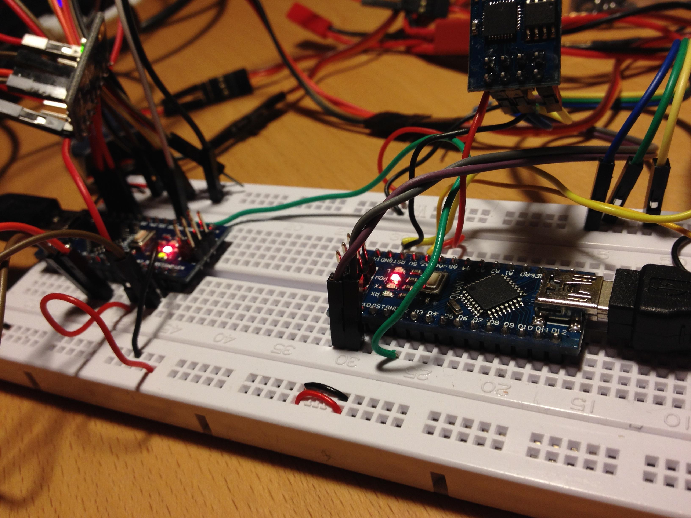

Additionally, we started to work on a little compartment below the frame to put all ESC (electronic speed control) tidy in place.

# Day 3

First, we had to fix the connection between the ESP8266 and the microcontroller. This was tedious, but we got it working.

Because we already connected everything the day before we now continued to draw our circuit connections. In the end, we did not include the landing lights. Other than this everything went according to our plan below:

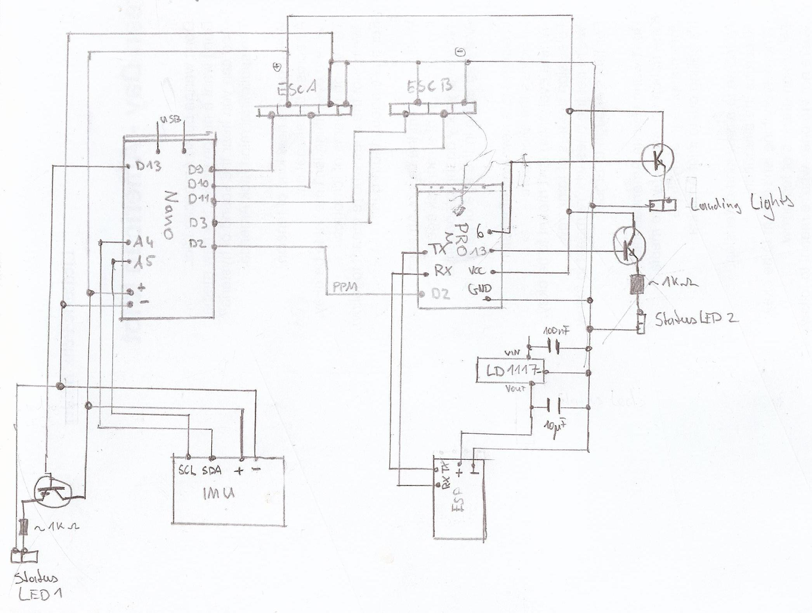

We tested multiple motors at once. Before we only tested them one by one. The vibrations were quite strong. When looking on the internet, no one else cared for vibrations this much. Therefore we continued and care about it later.

So in the end we could connect all components. This showed, that our planning was well executed. And we did not miss a single part.

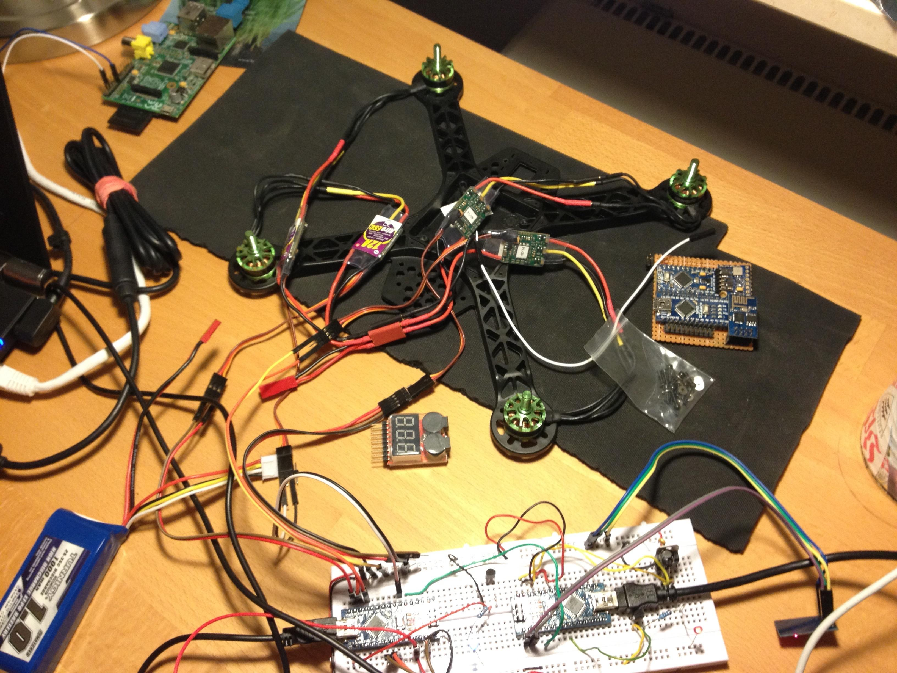

We continued to explore MultiWii. This was a very complex topic since we had never configured a PID-controller (proportional–integral–derivative) before. Other than this the config was pretty straightforward. We had to use the MultiWii-Interface to arm our quadcopter. Using our gaming controllers was not yet possible, because the python-script was not mature enough.

# Day 4

Next up we started planning on how to align our components. We did not expect that aligning all components would take this much time. So this was work for nearly the whole day. The image below shows a setup, which works, but the number of cables below would be tedious.

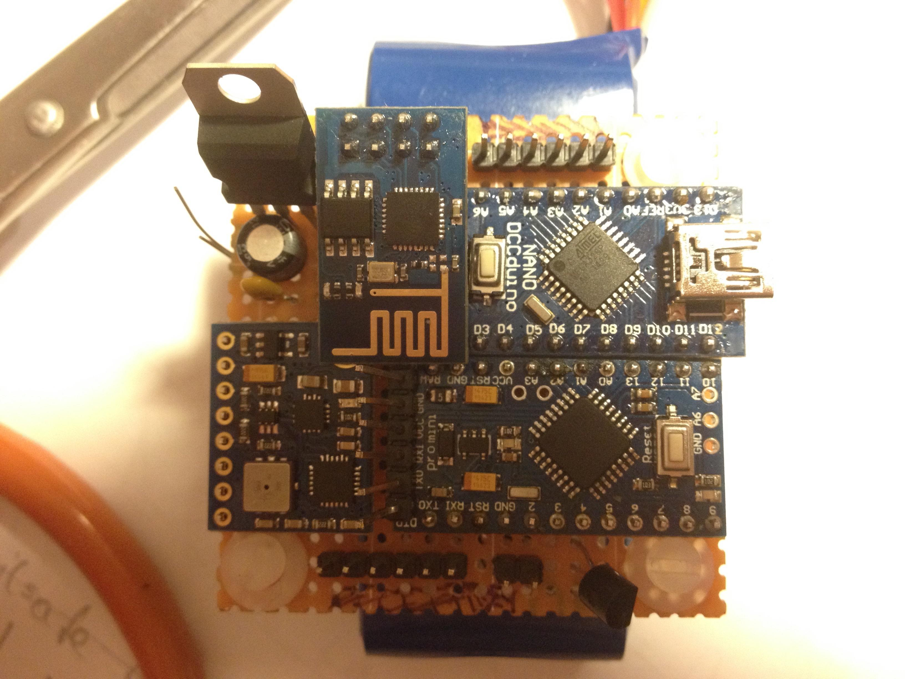

Additionally, we soldered some more cables and fixated the ESC below the frame.
Lastly, we tested how the fail-safe works if the connection is lost.

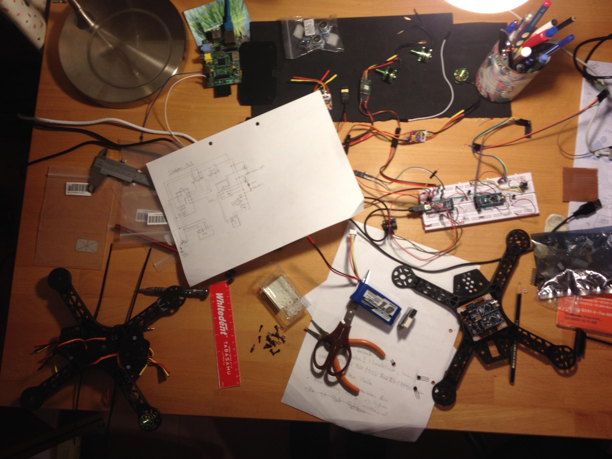

# Day 5

We redesigned the layout of our components and finally came up with the following Layout. Keep in mind, that this is an image of the bottom view of our breadboard.

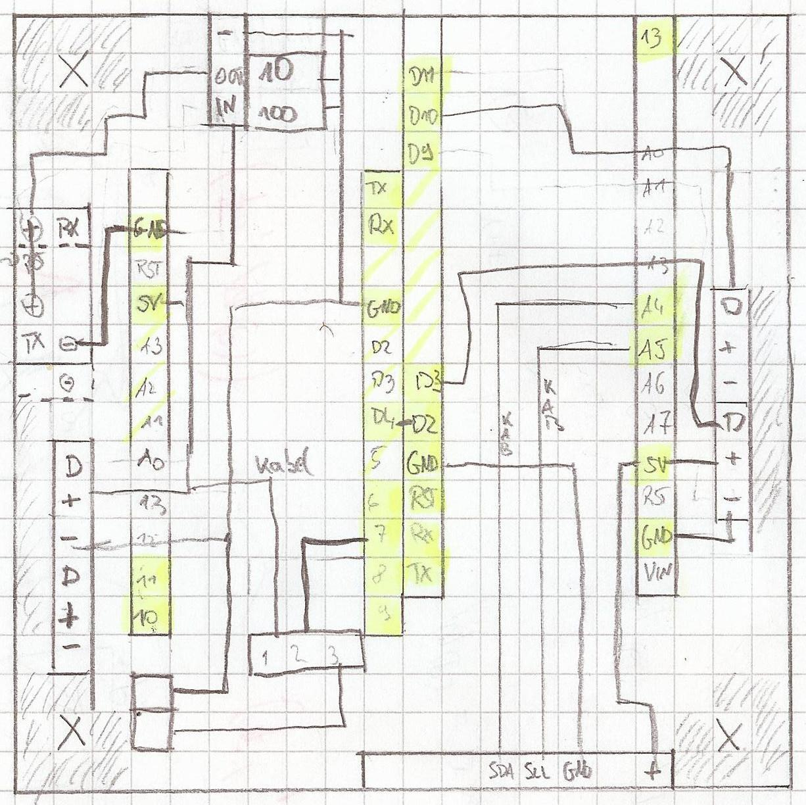

Friedrich started soldering the first breadboard. Saving money by buying a cheap breadboard was a very bad idea. The little disks were dropping off by just having the soldering iron close to them. So this work was quite frustrating.

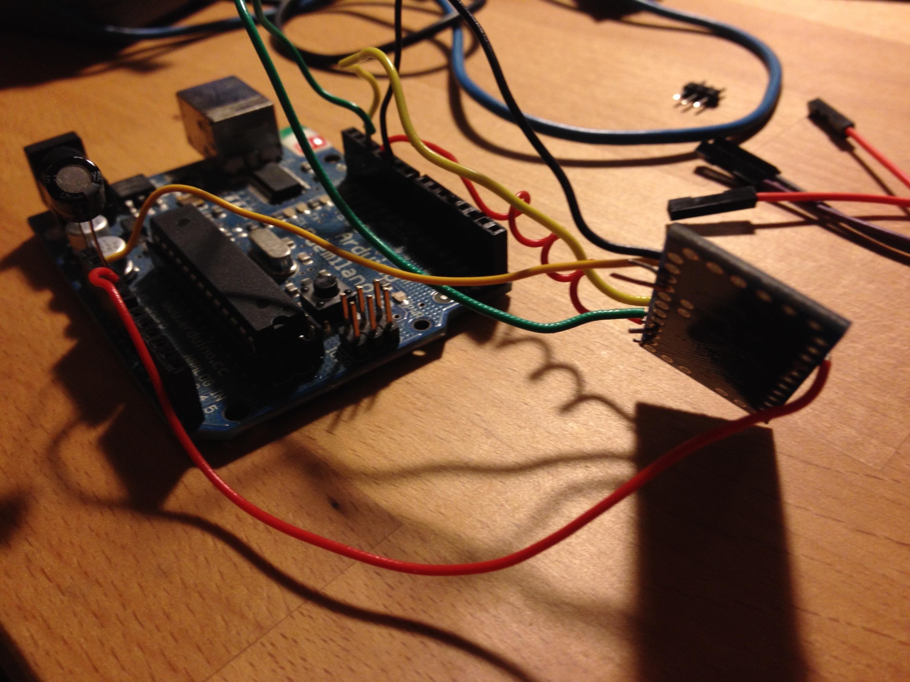

Before we always used the Arduino Pro for testing. We both think, that we will never flash the microcontroller between the flight controller and the ESP8266 again, and therefore we decided to go with an Arduino Pro Mini. (It does not have a USB connection.) So we had to flash it before soldering it in place. While Friedrich was soldering I continued to care about the microcontroller.

# Day 6

We flashed every device again because we lost track of what has been flashed and whatnot, before putting the devices on the breadboard.
The soldered breadboard did not work as expected. Therefore it took us the whole day to find many wrong solderings.

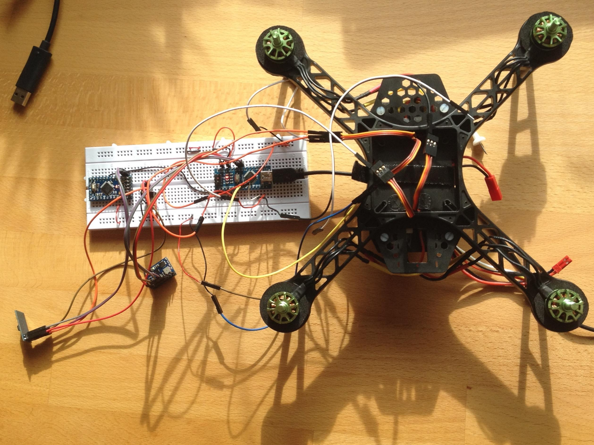

This day was not our best day, because we recognized, that having only seven days for this project was a very tight schedule.

# Day 7

We both agreed on the mapping for our controllers. Maybe this is valuable to someone. Therefore Felix continued to modularise the python scripts.

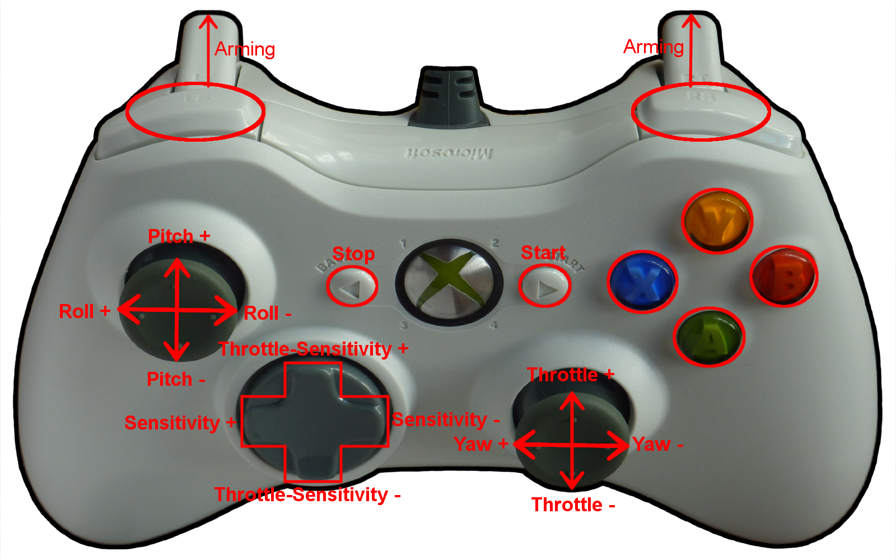

Freidrich tested everything again on the plug-in board. And no error was found. So he decided to solder the second board and see if it is possible. The second one worked like a charm. Below you can see an image:

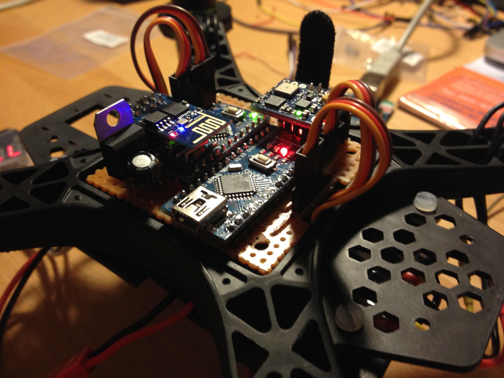

So fixing the first board was the task for the rest of the day.

# Day 8+

Next up we decided continue each ourselves. The building was complete, but the software for the computer was not. Therefore we split up the work. I was doing the work to send the data via wifi. Friedrich did the beautiful website to verify for us, that the data we are sending is correct. Which can be seen below:

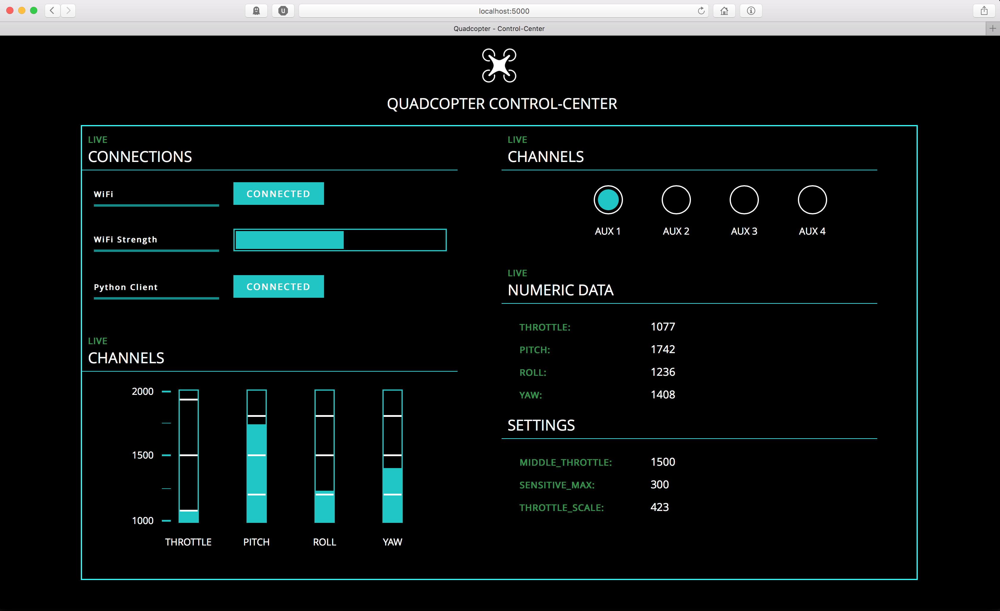

In the end, both of our quadcopters are flying. We did not expect, that the controls were this responsive. We were used to fully sliding the stick to one side from gaming. Therefore we had to learn a lot to improve our skills. 

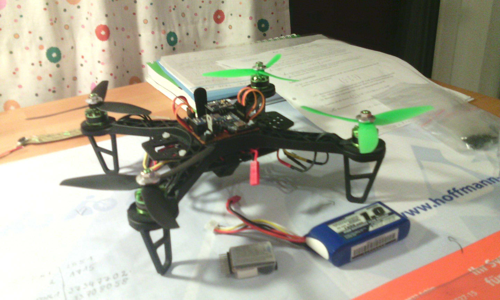

Overall it was a great learning experience for both of us. We learned a lot about debugging in hardware. Having a result, that is flying is the most satisfying reward.

# Update 1

We do not recommend using Wifi for data transmission. It works fine while the connection is stable. But if it drops the reconnecting takes a long time. So this project should be considered more as a proof of concept. Instead, better use radio transmission. (We saved some money because the laptop and the controllers did exist before our project.)

# Update 2

Making your own flight controller design is a useful process for learning. But the prices for flight controllers are dropping. So in the future buying one be cheaper than building it yourself.